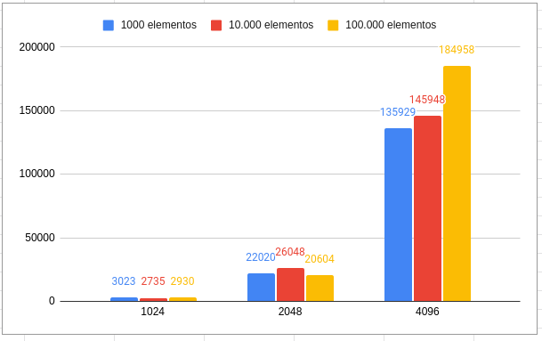
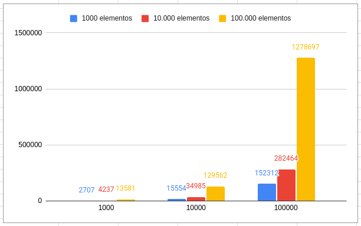

# RSA em Java
Está página contém uma implementação do algoritmo de criptografia RSA em java e alguns experimentos, 
 variando o tamanho da chave utilizada pelo algoritmo para os valores 1024, 2048 e 4096 para observar o comportamento
do algoritmo. Também foram registrados os tamanhos de chave.

# Comparação do algoritmo RSA para diferentes tamanhos de chave
Foram realizados experimentos contendo operações de cifrar e decifrar para conjuntos de 1000, 10.000 e 100.000 de elementos. Cada elemento a ser criptografado/descriptografado é uma string de 9 caracteres, contendo 5 dígitos númericos separados pelo caracter ':', um exemplo seria:
3:6:7:9:3. 

Para cada conjunto ocorreram execuções para chaves de tamanho 1024, 2048 e 4096, registrando o tempo (milisegundos) utilizado em milisegundos. A Figura 1 ilustra os tempos de execução
 para operações de criptografar para os três tamanhos de chave para os três conjuntos de elementos do experimento. Adicionalmente, para chaves de tamanho 1024 todos os elementos criptografados resultantes foram strings com 256 caracteres, para tamanho 2048 o tamanho das strings foi 512 caracteres, e para 4096 foi 1024 caracteres.

  
  
Figura 1 - Tempo de para criptografar em milisegundos para distintos tamanhos de chave

 
De mesma forma foi realizada a comparação entre os tempos para descriptografar os elementos criptografados, esses resultados são apresentados na Figura 2. 

 

  
  
Figura 2 -  Tempo de para descriptografar em milisegundos para distintos tamanhos de chave

 

Os arquivos contendo as entradas para os experimentos podem ser encontrados no diretorio ./experimentos.

 
